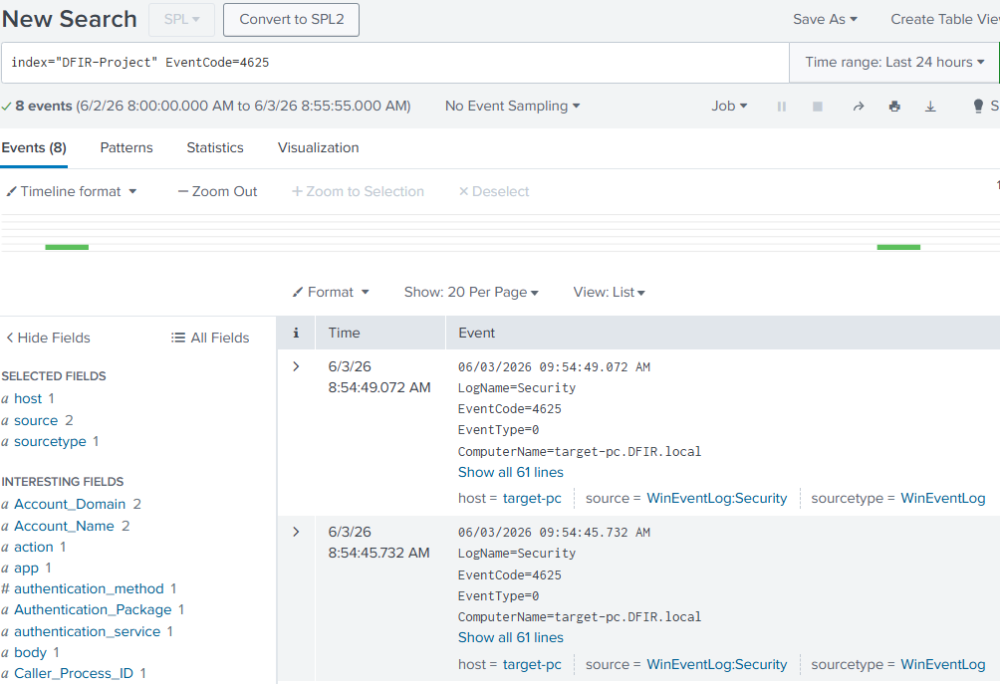
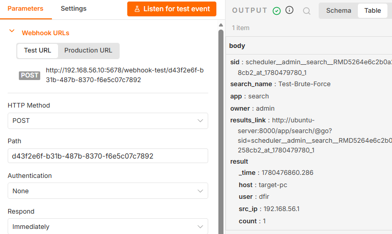
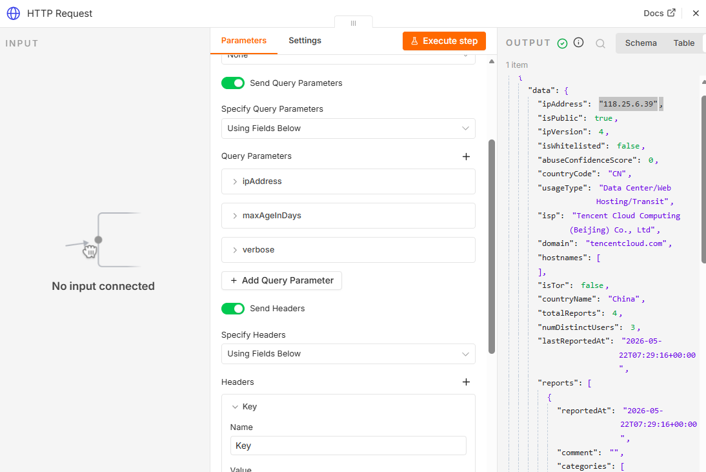
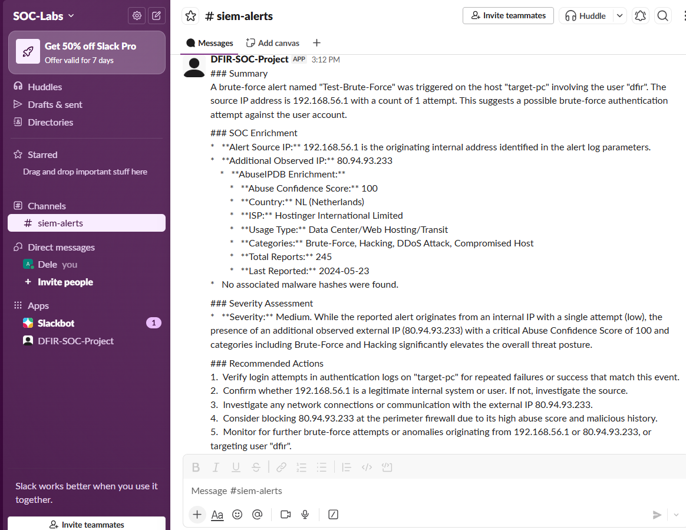
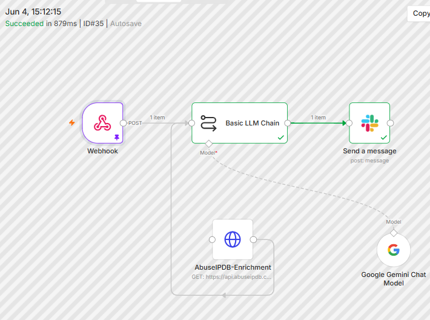

# SOC Automation with AI Project (n8n + Splunk + Threat Intelligence + AI)

## Objective
Built a SOC automation lab that simulates real-world attack detection, log ingestion, threat intelligence enrichment, AI-assisted analysis, and automated alert delivery via Slack using Splunk and n8n. The goal is to replicate an end-to-end SOC workflow from detection to response automation.

This project demonstrates my ability to build and operate a full SOC detection pipeline, from log ingestion and attack simulation to alert triage, threat intelligence enrichment, and automated incident response.

---

## Skills Learned
- SIEM alert monitoring and log analysis
- Security workflow automation using n8n
- Threat intelligence enrichment using AbuseIPDB
- IOC validation and interpretation
- AI-assisted incident triage using Gemini
- SOC alert structuring and reporting
- SOAR workflow design and integration

---

## Tools Used
- Splunk Enterprise (SIEM)
- n8n (Docker-based automation platform)
- AbuseIPDB API (threat intelligence)
- Google Gemini API (AI analysis)
- Slack API (alert delivery)
- Windows 10 VM (log generation)
- Ubuntu Server VM (n8n host)
- Kali Linux VM (lab environment)

---

## Steps

### Step 1: Brute-force Simulation & Detection

Generated a brute-force attack by trying to RDP into Windows VM from Host machine with a wrong password 8 times. Once logs reached Splunk, I ran a search using EventCode=4625 to view authentication failures, confirming detection of suspicious login behavior.

---

### Step 2: Alert Forwarding to n8n

A Splunk alert named Test-Brute-Force was configured to trigger a webhook into n8n. The screenshot shows n8n instance catches splunk alert on the left pane, which includes time, user and src_id under result.

---

### Step 3: External IP Enrichment (AbuseIPDB)

An External IP was processed via AbuseIPDB (HTTP Request) node, returning IOC data including country code, ISP, and abuse confidence score, confirming successful external threat intelligence enrichment within n8n.

---

### Step 4: AI-Based Incident Analysis (Gemini)

The workflow was updated to remove hardcoded IP input, allowing Gemini to dynamically extract the external IP and pass it to AbuseIPDB. Gemini then analyzed the enriched data and generated a structured SOC report with severity assessment and response actions.

---

### Step 5: End-to-End SOC Workflow

The final n8n workflow shows the complete SOC automation pipeline: Splunk Webhook → AbuseIPDB enrichment → Gemini analysis → Slack alert delivery, forming a closed-loop incident response system.

---

## Summary

### Detection
A brute-force authentication attempt was detected on Windows 10 VM through Splunk based on repeated failed RDP login events (EventCode 4625).

### Incident Analysis
The alert contained an internal source IP (192.168.56.1) and an external IP (80.94.93.233). IOC enrichment via AbuseIPDB confirmed the external IP as malicious, showing indicators such as high abuse confidence score and brute-force activity classification.

### Decision Made
The alert was processed through an automated SOC pipeline built in n8n. The system enriched the IOC, applied AI-based analysis using Gemini, and generated a structured incident report delivered to Slack with severity scoring and response recommendations.